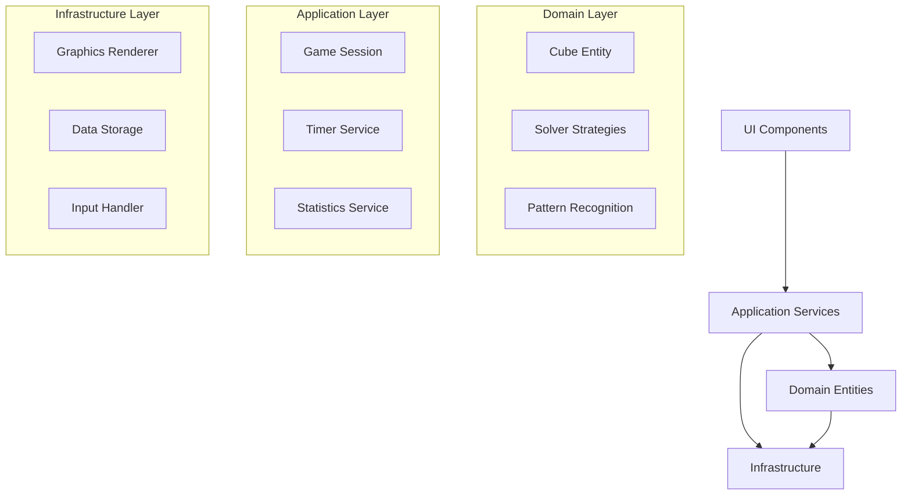

# Architecture Documentation

## Table of Contents

- [Overview](#overview)
- [Design Principles](#design-principles)
- [System Architecture](#system-architecture)
- [Component Design](#component-design)
- [Data Flow](#data-flow)
- [Performance Architecture](#performance-architecture)
- [Design Decisions](#design-decisions)
- [Future Considerations](#future-considerations)

## Overview

The Advanced Rubik's Cube Simulator is built using a clean, layered architecture that separates concerns and enables maintainability, testability, and extensibility. The system is designed to handle multiple cube sizes (2x2 through 10x10) while maintaining 60 FPS performance and providing authentic speedcubing functionality.

### Key Requirements Addressed

- **Realistic 3D rendering** with smooth 60 FPS performance
- **Authentic solving algorithms** (not move reversal)
- **Multiple cube sizes** with adaptive performance scaling
- **Educational features** for learning cube solving
- **Competition-grade timing** and WCA compliance
- **Extensible architecture** for future enhancements

## Design Principles

### 1. Clean Architecture

The system follows Uncle Bob's Clean Architecture principles:

```
┌─────────────────────────────────────────┐
│         External Interfaces            │ ← Frameworks, UI, Database
├─────────────────────────────────────────┤
│         Interface Adapters              │ ← Controllers, Gateways, Presenters
├─────────────────────────────────────────┤
│            Use Cases                    │ ← Application Business Rules
├─────────────────────────────────────────┤
│             Entities                    │ ← Enterprise Business Rules
└─────────────────────────────────────────┘
```

**Benefits:**
- Independent of frameworks and databases
- Testable business logic
- Independent of UI
- Database and external service agnostic

### 2. Domain-Driven Design (DDD)

Core domain concepts are modeled explicitly:

- **Cube**: Aggregate root managing cube state and moves
- **Solver**: Strategy pattern for different solving methods
- **Pattern**: Value objects representing algorithm cases
- **Session**: Aggregate managing game state and statistics

### 3. SOLID Principles

**Single Responsibility**: Each class has one reason to change
- `Cube` manages cube state only
- `Renderer` handles graphics only
- `TimerService` manages timing only

**Open/Closed**: Open for extension, closed for modification
- New solving methods implement `ISolver` interface
- New cube sizes handled by existing framework
- Graphics backends swappable via `IRenderer`

**Liskov Substitution**: Subtypes must be substitutable
- All `ISolver` implementations work with any `ICube`
- Any `IRenderer` can render any cube

**Interface Segregation**: Clients depend only on needed interfaces
- UI components use specific view interfaces
- Solvers don't depend on graphics interfaces

**Dependency Inversion**: Depend on abstractions, not concretions
- High-level modules define interfaces
- Low-level modules implement interfaces

## System Architecture

### Layered Architecture

```
┌─────────────────────────────────────────────────────────────┐
│                    PRESENTATION LAYER                       │
│ ┌─────────────────┐ ┌─────────────────┐ ┌─────────────────┐ │
│ │  UI Components  │ │    Controls     │ │    Displays     │ │
│ │ • Settings Panel│ │ • Mouse Handler │ │ • Statistics    │ │
│ │ • Timer Widget  │ │ • Keyboard Input│ │ • Move History  │ │
│ │ • Tutorial Sys  │ │ • Touch Handler │ │ • Progress      │ │
│ └─────────────────┘ └─────────────────┘ └─────────────────┘ │
└─────────────────────────────────────────────────────────────┘
┌─────────────────────────────────────────────────────────────┐
│                   APPLICATION LAYER                         │
│ ┌─────────────────┐ ┌─────────────────┐ ┌─────────────────┐ │
│ │   Use Cases     │ │  Orchestration  │ │ App Services    │ │
│ │ • SolveCube     │ │ • Game Session  │ │ • Timer Service │ │
│ │ • ScrambleCube  │ │ • Animation Mgr │ │ • Statistics    │ │
│ │ • TrainAlgorithm│ │ • State Manager │ │ • Export Service│ │
│ └─────────────────┘ └─────────────────┘ └─────────────────┘ │
└─────────────────────────────────────────────────────────────┘
┌─────────────────────────────────────────────────────────────┐
│                     DOMAIN LAYER                            │
│ ┌─────────────────┐ ┌─────────────────┐ ┌─────────────────┐ │
│ │  Cube Domain    │ │ Solving Domain  │ │ Pattern Domain  │ │
│ │ • Cube Entity   │ │ • Solver Factory│ │ • Pattern Lib   │ │
│ │ • Move System   │ │ • CFOP Solver   │ │ • Scramble Gen  │ │
│ │ • State Validator│ │ • Layer Solver  │ │ • Algorithm DB  │ │
│ └─────────────────┘ └─────────────────┘ └─────────────────┘ │
└─────────────────────────────────────────────────────────────┘
┌─────────────────────────────────────────────────────────────┐
│                 INFRASTRUCTURE LAYER                        │
│ ┌─────────────────┐ ┌─────────────────┐ ┌─────────────────┐ │
│ │ Graphics Engine │ │    Storage      │ │  External APIs  │ │
│ │ • 3D Renderer   │ │ • Config Store  │ │ • WCA Standards │ │
│ │ • Animation Sys │ │ • Save/Load     │ │ • Competition   │ │
│ │ • Camera System │ │ • User Profiles │ │ • Tutorial Data │ │
│ └─────────────────┘ └─────────────────┘ └─────────────────┘ │
└─────────────────────────────────────────────────────────────┘
```

### Component Relationships



## Component Design

### Domain Layer Components

#### Cube Entity
```python
class Cube:
    """Aggregate root for cube state and operations"""
    
    def __init__(self, size: int):
        self._size = size
        self._state = CubeState(size)
        self._move_history = MoveHistory()
        self._domain_events = []
    
    def execute_move(self, move: Move) -> None:
        """Execute move with domain validation"""
        if not self._is_valid_move(move):
            raise InvalidMoveError(move)
        
        self._state.apply_move(move)
        self._move_history.add(move)
        self._publish_event(MoveExecutedEvent(move))
    
    def _is_valid_move(self, move: Move) -> bool:
        """Domain-specific move validation"""
        return (
            move.face in VALID_FACES and
            move.direction in VALID_DIRECTIONS and
            self._size >= 2  # Minimum cube size
        )
```

#### Solving Strategies
```python
class SolvingStrategy(ABC):
    """Strategy pattern for solving algorithms"""
    
    @abstractmethod
    def solve(self, cube_state: CubeState) -> SolutionResult:
        pass
    
    @abstractmethod
    def get_phase_analysis(self, cube_state: CubeState) -> PhaseAnalysis:
        pass

class CFOPStrategy(SolvingStrategy):
    """CFOP solving with pattern recognition"""
    
    def __init__(self):
        self._phase_solvers = {
            Phase.CROSS: CrossSolver(),
            Phase.F2L: F2LSolver(),
            Phase.OLL: OLLSolver(),
            Phase.PLL: PLLSolver()
        }
        self._pattern_db = PatternDatabase()
    
    def solve(self, cube_state: CubeState) -> SolutionResult:
        solution_steps = []
        current_state = cube_state.clone()
        
        for phase in Phase:
            if not self._is_phase_complete(phase, current_state):
                steps = self._solve_phase(phase, current_state)
                solution_steps.extend(steps)
                current_state = self._apply_steps(current_state, steps)
        
        return SolutionResult(
            steps=solution_steps,
            method="CFOP",
            efficiency=self._calculate_efficiency(solution_steps)
        )
```

#### Pattern Recognition
```python
class PatternDatabase:
    """High-performance pattern recognition system"""
    
    def __init__(self):
        self._oll_patterns = self._load_oll_patterns()
        self._pll_patterns = self._load_pll_patterns()
        self._hash_tables = self._build_hash_tables()
        self._cache = LRUCache(maxsize=10000)
    
    def recognize_oll_case(self, cube_state: CubeState) -> Optional[OLLCase]:
        """O(1) OLL pattern recognition using hash lookup"""
        state_hash = self._hash_last_layer_orientation(cube_state)
        
        if state_hash in self._cache:
            return self._cache[state_hash]
        
        case = self._hash_tables['oll'].get(state_hash)
        if case:
            self._cache[state_hash] = case
        
        return case
    
    def _hash_last_layer_orientation(self, cube_state: CubeState) -> int:
        """Fast bit-manipulation based hashing"""
        hash_value = 0
        pieces = cube_state.get_last_layer_pieces()
        
        for i, piece in enumerate(pieces):
            if piece.is_correctly_oriented():
                hash_value |= (1 << i)
        
        return hash_value
```

### Application Layer Components

#### Game Session Manager
```python
class GameSession:
    """Orchestrates game flow and coordinates components"""
    
    def __init__(self, cube_size: int):
        self._cube = Cube(cube_size)
        self._timer = TimerService()
        self._statistics = StatisticsService()
        self._state = SessionState.READY
        self._solver_factory = SolverFactory()
    
    def start_solve_session(self, method: str) -> None:
        """Begin new solving session"""
        self._validate_solve_start()
        
        solver = self._solver_factory.create_solver(method)
        self._current_solver = solver
        self._state = SessionState.SOLVING
        self._timer.start()
        
        self._publish_event(SolveSessionStarted(method))
    
    def complete_solve(self) -> SolveResult:
        """Complete solve and record statistics"""
        if self._state != SessionState.SOLVING:
            raise InvalidStateError("No active solve session")
        
        time_result = self._timer.stop()
        move_count = len(self._cube.get_move_history())
        
        result = SolveResult(
            time=time_result.total_time,
            move_count=move_count,
            tps=move_count / time_result.total_time,
            method=self._current_solver.get_method_name()
        )
        
        self._statistics.record_solve(result)
        self._state = SessionState.COMPLETED
        
        return result
```

#### Animation Manager
```python
class AnimationManager:
    """Coordinates smooth cube animations"""
    
    def __init__(self):
        self._active_animations = []
        self._animation_queue = Queue()
        self._speed_multiplier = 1.0
    
    def animate_move(self, move: Move, duration: float = 0.3) -> AnimationHandle:
        """Create smooth move animation"""
        animation = MoveAnimation(
            move=move,
            duration=duration * self._speed_multiplier,
            easing=EasingFunction.EASE_OUT_CUBIC
        )
        
        handle = AnimationHandle(animation)
        self._active_animations.append(animation)
        
        return handle
    
    def update(self, delta_time: float) -> None:
        """Update all active animations"""
        completed_animations = []
        
        for animation in self._active_animations:
            animation.update(delta_time)
            
            if animation.is_complete():
                completed_animations.append(animation)
                animation.on_complete()
        
        # Remove completed animations
        for animation in completed_animations:
            self._active_animations.remove(animation)
```

### Infrastructure Layer Components

#### Graphics Renderer
```python
class ModernGLRenderer:
    """High-performance OpenGL renderer"""
    
    def __init__(self, window_size: Tuple[int, int]):
        self._context = moderngl.create_context()
        self._shader_cache = {}
        self._vertex_buffers = {}
        self._frame_buffer = None
        
        self._setup_shaders()
        self._setup_buffers()
    
    def render_frame(self, cube: ICube, camera: Camera) -> None:
        """Render complete frame with optimizations"""
        self._context.clear()
        
        # Frustum culling - only render visible pieces
        visible_pieces = self._cull_pieces(cube.get_pieces(), camera)
        
        # Level-of-detail based on camera distance
        lod_pieces = self._apply_lod(visible_pieces, camera)
        
        # Batch rendering by material
        piece_batches = self._batch_by_material(lod_pieces)
        
        for material, pieces in piece_batches.items():
            self._render_batch(material, pieces, camera)
    
    def _batch_by_material(self, pieces: List[Cubie]) -> Dict[Material, List[Cubie]]:
        """Group pieces by material to minimize state changes"""
        batches = defaultdict(list)
        for piece in pieces:
            material = piece.get_material()
            batches[material].append(piece)
        return batches
    
    def _render_batch(self, material: Material, pieces: List[Cubie], camera: Camera) -> None:
        """Render batch of pieces with same material"""
        shader = self._get_shader(material.shader_type)
        shader.use()
        
        # Set material properties
        shader.set_uniform("material.diffuse", material.diffuse)
        shader.set_uniform("material.specular", material.specular)
        shader.set_uniform("material.shininess", material.shininess)
        
        # Set camera matrices
        shader.set_uniform("view", camera.get_view_matrix())
        shader.set_uniform("projection", camera.get_projection_matrix())
        
        # Instance rendering for identical geometry
        if len(pieces) > 1:
            self._render_instanced(pieces, shader)
        else:
            self._render_single(pieces[0], shader)
```

## Data Flow

### User Input Flow
```
User Input → Input Handler → Command → Application Service → Domain Entity → Event
    ↓
UI Update ← Presenter ← Event Handler ← Domain Event ← Domain Entity
```

### Solving Flow
```
User Request → GameSession → SolverFactory → ConcreteSolver → PatternDB
     ↓              ↓            ↓              ↓            ↓
Statistics ← SolveResult ← SolutionSteps ← Algorithm ← PatternMatch
```

### Rendering Flow
```
Game State → AnimationManager → Renderer → GPU Pipeline → Display
     ↓              ↓             ↓           ↓           ↓
UI Updates ← Frame Events ← Render Events ← GPU Events ← VSync
```

## Performance Architecture

### Memory Management Strategy

#### Object Pooling
```python
class ObjectPoolManager:
    """Manages object pools to reduce GC pressure"""
    
    def __init__(self):
        self._move_pool = ObjectPool(Move, factory=lambda: Move("R", 1))
        self._step_pool = ObjectPool(SolutionStep, factory=SolutionStep.empty)
        self._state_pool = ObjectPool(CubeState, factory=lambda: CubeState(3))
    
    def get_move(self) -> Move:
        return self._move_pool.get()
    
    def return_move(self, move: Move) -> None:
        move.reset()  # Clear state
        self._move_pool.return_object(move)
```

#### Memory Layout Optimization
```python
class CompactCubeState:
    """Memory-optimized cube representation for large sizes"""
    
    def __init__(self, size: int):
        self.size = size
        
        if size <= 5:
            # Full object representation for better performance
            self._pieces = [Cubie(pos) for pos in self._generate_positions()]
        else:
            # Compressed bit representation for memory efficiency
            self._face_data = bytearray(6 * size * size * 3)  # RGB per sticker
            self._piece_cache = {}  # Lazy-loaded pieces
    
    def get_piece(self, position: Position) -> Cubie:
        """Get piece with lazy loading for large cubes"""
        if self.size <= 5:
            return self._pieces[self._position_to_index(position)]
        else:
            if position not in self._piece_cache:
                self._piece_cache[position] = self._reconstruct_piece(position)
            return self._piece_cache[position]
```

### Rendering Performance

#### Level of Detail (LOD)
```python
class LODManager:
    """Manages level-of-detail for performance scaling"""
    
    LOD_THRESHOLDS = {
        'high': 0,      # Distance 0-8 units
        'medium': 8,    # Distance 8-16 units  
        'low': 16       # Distance 16+ units
    }
    
    def get_lod_level(self, piece: Cubie, camera: Camera) -> str:
        distance = camera.get_distance_to(piece.position)
        
        if distance < self.LOD_THRESHOLDS['medium']:
            return 'high'
        elif distance < self.LOD_THRESHOLDS['low']:
            return 'medium'
        else:
            return 'low'
    
    def apply_lod(self, pieces: List[Cubie], camera: Camera) -> List[RenderPiece]:
        """Apply appropriate LOD to pieces"""
        render_pieces = []
        
        for piece in pieces:
            lod_level = self.get_lod_level(piece, camera)
            render_piece = RenderPiece(
                piece=piece,
                geometry=self._get_lod_geometry(lod_level),
                material=self._get_lod_material(lod_level)
            )
            render_pieces.append(render_piece)
        
        return render_pieces
```

#### Adaptive Quality Scaling
```python
class PerformanceMonitor:
    """Monitors performance and adjusts quality dynamically"""
    
    def __init__(self, target_fps: float = 60.0):
        self.target_fps = target_fps
        self.frame_times = deque(maxlen=60)
        self.quality_level = QualityLevel.HIGH
    
    def update_frame_stats(self, frame_time: float) -> None:
        self.frame_times.append(frame_time)
        
        if len(self.frame_times) == 60:  # Every 60 frames
            avg_fps = 1.0 / (sum(self.frame_times) / len(self.frame_times))
            
            if avg_fps < self.target_fps * 0.8:  # 20% below target
                self._reduce_quality()
            elif avg_fps > self.target_fps * 1.1:  # 10% above target
                self._increase_quality()
    
    def _reduce_quality(self) -> None:
        if self.quality_level == QualityLevel.HIGH:
            self.quality_level = QualityLevel.MEDIUM
            self._disable_feature('reflections')
        elif self.quality_level == QualityLevel.MEDIUM:
            self.quality_level = QualityLevel.LOW
            self._disable_feature('shadows')
            self._reduce_texture_quality(0.5)
```

### Algorithm Performance

#### Pattern Recognition Optimization
```python
class HashBasedPatternMatcher:
    """Optimized pattern matching using hash tables"""
    
    def __init__(self):
        self._oll_hash_table = self._build_oll_hash_table()
        self._pll_hash_table = self._build_pll_hash_table()
        self._cache = LRUCache(maxsize=10000)
    
    def _build_oll_hash_table(self) -> Dict[int, OLLCase]:
        """Pre-compute hash table for O(1) OLL recognition"""
        hash_table = {}
        
        for case in OLL_CASES:
            # Generate all possible orientations of this case
            for rotation in [0, 90, 180, 270]:
                rotated_pattern = case.pattern.rotate(rotation)
                pattern_hash = self._hash_pattern(rotated_pattern)
                hash_table[pattern_hash] = case
        
        return hash_table
    
    def _hash_pattern(self, pattern: Pattern) -> int:
        """Fast pattern hashing using bit manipulation"""
        hash_value = 0
        
        for i, orientation in enumerate(pattern.orientations):
            hash_value |= (orientation << (i * 2))  # 2 bits per piece
        
        return hash_value
```

## Design Decisions

### 1. Architecture Pattern Choice

**Decision**: Clean Architecture with DDD
**Rationale**: 
- Separates business logic from technical concerns
- Enables independent testing of core algorithms
- Supports multiple UI frameworks (desktop, web, mobile)
- Facilitates algorithm verification and validation

**Alternatives Considered**:
- MVC: Too simple for complex domain logic
- Layered Architecture: Coupling between layers
- Microservices: Overkill for single application

### 2. Solving Algorithm Design

**Decision**: Strategy Pattern with Factory
**Rationale**:
- Easy to add new solving methods
- Algorithms can be tested independently
- Users can switch methods at runtime
- Supports educational progression (beginner → advanced)

**Implementation**:
```python
class SolverFactory:
    def create_solver(self, method: str) -> ISolver:
        solvers = {
            'layer-by-layer': LayerByLayerSolver,
            'cfop': CFOPSolver,
            'roux': RouxSolver,
            'zz': ZZSolver
        }
        
        solver_class = solvers.get(method)
        if not solver_class:
            raise UnsupportedMethodError(method)
        
        return solver_class()
```

### 3. State Management Approach

**Decision**: Event Sourcing for Move History
**Rationale**:
- Complete audit trail of all moves
- Enables undo/redo functionality
- Supports analysis and replay
- Facilitates debugging and testing

**Implementation**:
```python
class MoveHistory:
    def __init__(self):
        self._events = []
        self._position = 0
    
    def add_move(self, move: Move) -> None:
        # Truncate future events when adding new move
        self._events = self._events[:self._position]
        self._events.append(MoveEvent(move, timestamp=now()))
        self._position += 1
    
    def undo(self) -> Optional[Move]:
        if self._position > 0:
            self._position -= 1
            return self._events[self._position].move.inverse()
        return None
```

### 4. Graphics Architecture Choice

**Decision**: Modern OpenGL with ModernGL
**Rationale**:
- High performance for smooth 60 FPS
- Cross-platform compatibility
- Modern GPU features (instancing, compute shaders)
- Python integration with ModernGL

**Alternatives Considered**:
- Pygame: Limited 3D capabilities
- PyOpenGL: Verbose, older OpenGL patterns
- Vulkan: Too complex for this use case
- Unity: Different technology stack

### 5. Performance Optimization Strategy

**Decision**: Adaptive Quality Scaling
**Rationale**:
- Maintains target framerate across devices
- Graceful degradation for older hardware
- Automatic optimization without user intervention
- Supports wide range of cube sizes (2x2 to 10x10)

**Key Optimizations**:
- LOD based on camera distance
- Frustum culling for off-screen pieces
- Object pooling for memory management
- Hash-based pattern recognition
- Instanced rendering for identical geometry

### 6. Testing Strategy

**Decision**: Pyramid Testing with Property-Based Testing
**Rationale**:
- Unit tests for algorithm correctness
- Integration tests for component interaction
- Property-based testing for mathematical validation
- Performance tests for regression detection

```python
# Property-based testing example
@given(st.lists(valid_moves(), min_size=1, max_size=50))
def test_move_sequence_inverse_property(moves):
    """Test that applying moves then inverse returns to original state"""
    cube = Cube(3)
    original_state = cube.get_state()
    
    # Apply forward moves
    for move in moves:
        cube.execute_move(move)
    
    # Apply inverse moves in reverse order
    for move in reversed(moves):
        cube.execute_move(move.inverse())
    
    assert cube.get_state() == original_state
```

## Future Considerations

### Extensibility Points

1. **New Solving Methods**
   - Implement `ISolver` interface
   - Add to `SolverFactory`
   - Include pattern databases if needed

2. **Additional Cube Types**
   - Extend `CubeState` for non-cubic puzzles
   - Implement puzzle-specific move systems
   - Add specialized rendering

3. **AI Integration**
   - Machine learning for optimal solving
   - Computer vision for physical cube recognition
   - Advanced pattern recognition

4. **Multiplayer Features**
   - Online competitions
   - Real-time race mode
   - Leaderboards and rankings

### Scalability Considerations

1. **Performance Scaling**
   - Support for even larger cubes (15x15+)
   - GPU compute shaders for algorithm execution
   - Distributed solving for complex cases

2. **Data Management**
   - Cloud storage for user profiles
   - Algorithm database synchronization
   - Offline mode with sync

3. **Platform Expansion**
   - Web assembly compilation
   - Mobile native applications
   - VR/AR implementations

### Technical Debt Management

1. **Code Quality**
   - Regular refactoring cycles
   - Performance profiling
   - Security audits

2. **Documentation**
   - Keep architecture docs current
   - Algorithm correctness proofs
   - Performance benchmarks

3. **Testing**
   - Maintain test coverage >90%
   - Add regression tests for bug fixes
   - Performance test automation

This architecture provides a solid foundation for the Advanced Rubik's Cube Simulator while maintaining flexibility for future enhancements and ensuring high performance across all supported features.